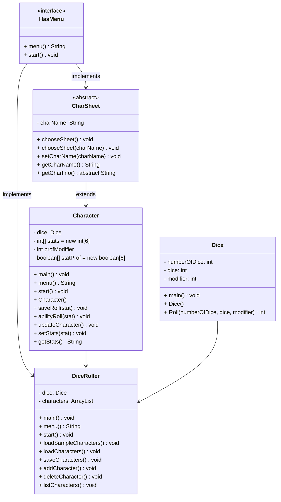

# DnDDiceRoller

## UML

```mermaid
classDiagram
    class HasMenu{
        <<interface>>
        + menu() String
        + start() void
    }
    class Dice{
        - numberOfDice: int
        - dice: int
        - modifier: int
        + main() void
        + Dice()
        + Roll(numberOfDice, dice, modifier) int
    }
    class CharSheet{
        <<abstract>>
        - charName: String
        + chooseSheet() void
        + chooseSheet(charName) void
        + setCharName(charName) void
        + getCharName() String
        + getCharInfo() abstract String
    }
    class Character{
        - dice: Dice
        - int[] stats = new int[6]
        - int profModifier
        - boolean[] statProf = new boolean[6]
        + main() void
        + menu() String
        + start() void
        + Character()
        + saveRoll(stat) void
        + abilityRoll(stat) void
        + updateCharacter() void
        + setStats(stat) void
        + getStats() String
    }
    class DiceRoller{
        - dice: Dice
        - characters: ArrayList
        + main() void
        + menu() String
        + start() void
        + loadSampleCharacters() void
        + loadCharacters() void
        + saveCharacters() void
        + addCharacter() void
        + deleteCharacter() void
        + listCharacters() void
    }

    HasMenu --> CharSheet: implements
    HasMenu --> DiceRoller: implements
    CharSheet --> Character: extends
    Character --> DiceRoller
    Dice --> DiceRoller
```
